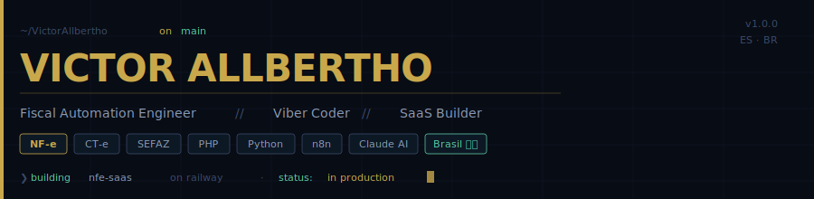

<br>

## Oi, eu sou o Victor

Estudante de Ciências Contábeis no ES, trabalhando na área fiscal com ICMS, PIS, COFINS no dia a dia. Comecei a aprender a programar por necessidade, queria automatizar coisas chatas no trabalho, e fui me apaixonando pelo processo.

Não sou dev senior nem especialista em nada ainda. Sei o básico de HTML, CSS, JS, PHP e Python, e estou construindo coisas reais enquanto aprendo.

```yaml
estudando  : Ciências Contábeis · Espírito Santo, BR
trabalhando: área fiscal - ICMS, PIS, COFINS, NF-e, SEFAZ
aprendendo : programação na prática, construindo projetos reais
stack base : HTML · CSS · JS · PHP · Python
explorando : automação com n8n, IA com Claude API, NF-e / XML
```

<br>

---

## Projetos

### NFE SaaS &nbsp;·&nbsp; [`nfe-saas-production.up.railway.app`](https://nfe-saas-production.up.railway.app/login.php)

Plataforma que estou construindo para automação de documentos fiscais NF-e, XML, integração com SEFAZ. É meu maior projeto até agora, feito com PHP e MySQL, rodando no Railway.

> Ainda em desenvolvimento ativo. Aprendendo muito no processo.


<br>

---

## O que sei usar

**Básico sólido**


**Ferramentas que uso**


**Contexto profissional**


<br>

---

## No momento

```
[construindo]  NFE SaaS - aprendendo PHP e arquitetura backend na prática
[explorando]   automação com n8n + Claude API
[estudando]    reforma tributária — CBS/IBS (EC 132/2023)
[aprendendo]   lógica fiscal aplicada à programação
```

<br>


---

[](https://github.com/VictorAllbertho)
[](https://www.linkedin.com/in/victor-allbertho-alves-de-lima-308968342/)
[](https://nfe-saas-production.up.railway.app/login.php)

<br>

---

<sub>Espírito Santo, Brasil · Fiscal Automation · SaaS · AI Tooling</sub>
